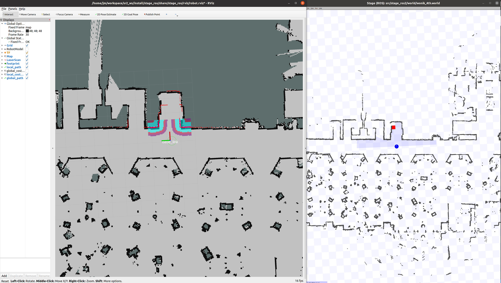
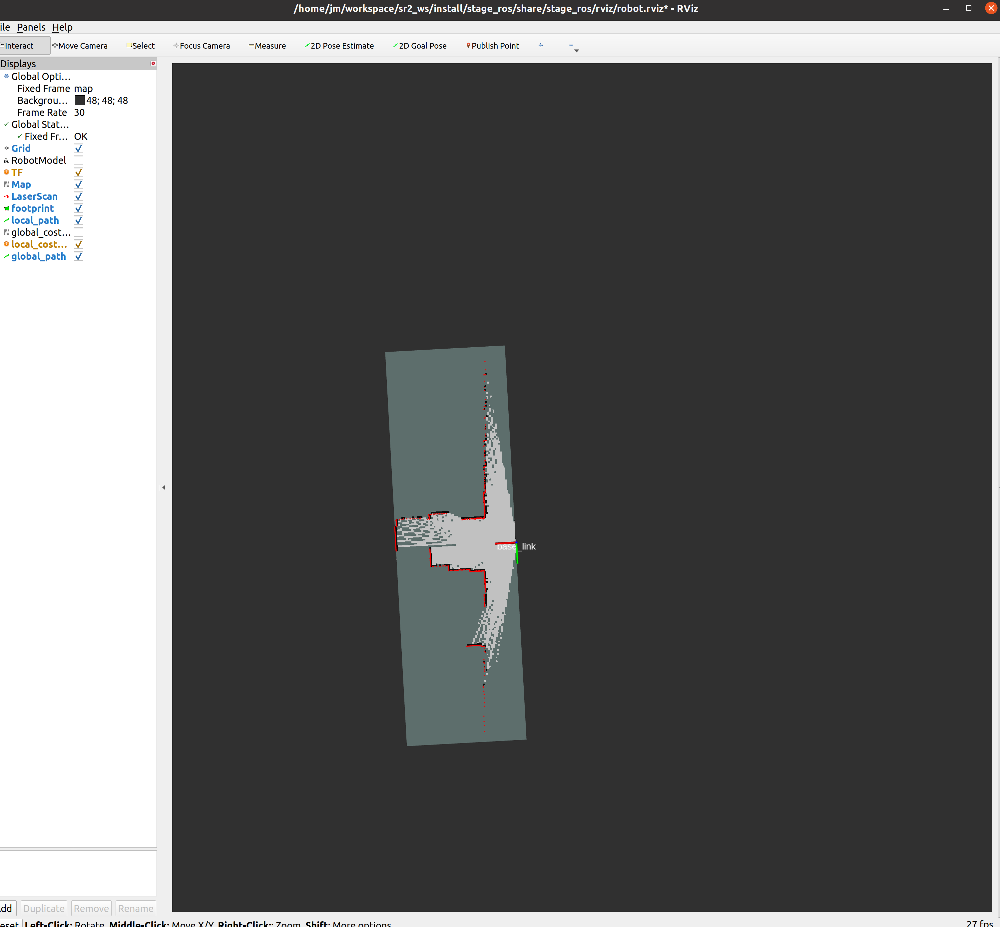

# Stage for Ros2
 
## Environment
**Ubuntu 20.04 ROS2 Galactic**

## Reference
https://github.com/n0nzzz/stage_ros2

## Installation
```bash
$ mkdir -p stage_ros2_ws/src
$ cd stage_ros2_ws/src
$ git clone https://github.com/woawo1213/stage_ros2.git
$ sudo apt-get install ros-noetic-stage # for FLTK
$ cd ..
$ colcon build
```

## Quick Start

### Robot Stage
```
ros2 run stage_ros stageros src/stage_ros2/world/wonik_4th.world
```


### Robot Navigation
Launch 파일 실행 시 다음 옵션 사용

```
# Navigation
ros2 launch stage_ros robot_launch nav:=true
```
2D Pose Estimate로 위치초기화, 2D Goal Pose로 목적지 설정



### Robot SLAM
Launch 파일 실행 시 다음 옵션 사용
```
# Terminal 1
ros2 launch stage_ros robot_launch slam:=true

# Terminal 2
ros2 run teleop_twist_keyboard teleop_twist_keyboard

# Terminal 3
ros2 launch teleop_twist_joy teleop-launch.py joy_config:='xbox'
```
